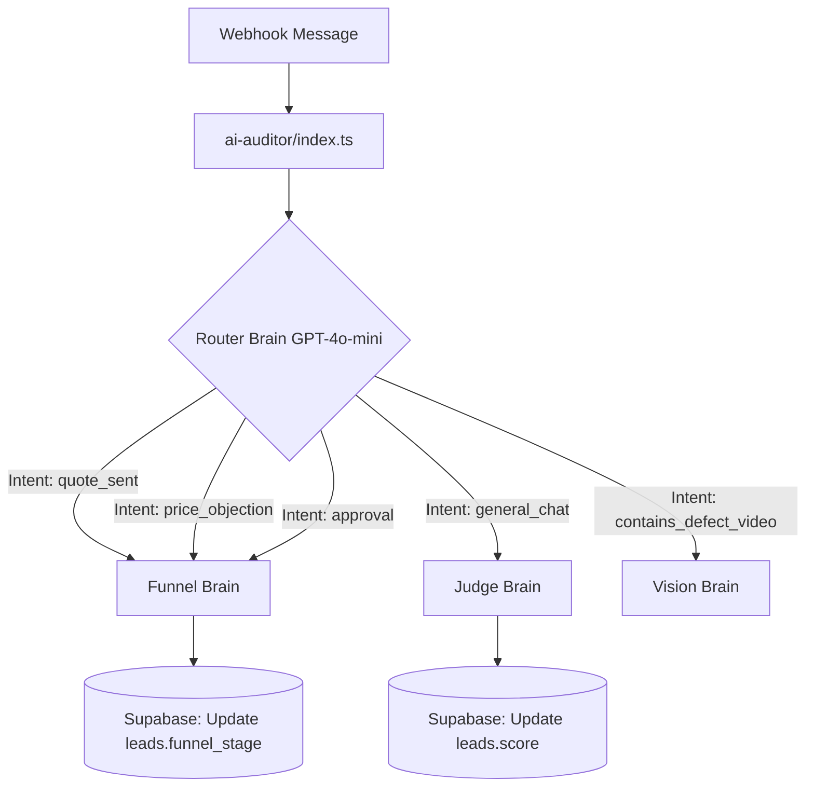

# Design: AI Autonomous Funnel (Multi-Agent)

## Arquitetura Multi-Agente (Edge Functions)

A arquitetura no Supabase para a função `ai-auditor` passará a adotar o padrão de **Semantic Router & Specialized Workers**.

### Componentes Internos
- **`router.ts` (O Cérebro Roteador):** Um prompt focado APENAS em ler a mensagem atual + contexto das últimas 3 mensagens e devolver um JSON estrito: `{ "intent": "objection", "requires_funnel_update": true, "requires_vision": false }`.
- **`funnel.ts` (O Mini-Cérebro do Funil):** Recebe o contexto e a intenção, e decide com base em regras de negócio em qual estágio o lead deve ficar. Retorna `newStage`.
- **`judge.ts` (O Auditor):** Focado APENAS em pontuar checklist premium de mecânica.

## Supabase Schema Changes
Nenhuma nova tabela é necessária. Apenas assegurar que a função tem acesso irrestrito para atualizar `funnel_stage` da tabela `leads`.

## Frontend (Stitch MCP)
Nenhuma alteração de UI maciça é requerida, pois o Kanban do React já reflete alterações do Supabase em tempo real graças ao `useEffect` do `AppDataContext` (ou polling/realtime já existente). O foco total é no backend.
