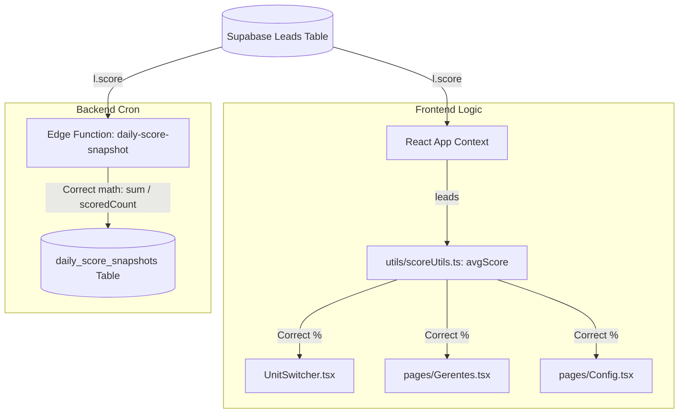

# Design: KPI Score Logic Overhaul

This document outlines the software design, code architecture, and database mapping modifications for standardizing the score calculations.

---

## 🛠️ Code Architecture Design

To ensure high-quality DRY (Don't Repeat Yourself) code, we will maximize the reuse of the standard `avgScore` and `avgScoreInt` utility functions located in `src/utils/scoreUtils.ts`.



---

## 📂 Proposed File Changes

### Frontend Components

#### 1. [UnitSwitcher.tsx](file:///c:/Users/User/Desktop/vscode/projetos%20antigravity/gerentesmec/src/components/Crm/UnitSwitcher.tsx)
- **Change**: Import `avgScore` from `src/utils/scoreUtils.ts`.
- **Refactoring**: Replace manual reduce block with `avgScore(unitLeads)` or the correct math calculation:
  ```diff
-   const scored = unitLeads.filter(l => l.score !== null);
-   const score = (unitLeads.length > 0 && scored.length > 0)
-     ? Math.round((scored.reduce((a, l) => a + Number(l.score), 0) / unitLeads.length) * 10) / 10
-     : 0;
+   const score = avgScore(unitLeads);
  ```

#### 2. [Gerentes.tsx](file:///c:/Users/User/Desktop/vscode/projetos%20antigravity/gerentesmec/src/pages/Gerentes.tsx)
- **Change**: Import `avgScoreInt` from `src/utils/scoreUtils.ts` (as scores on this page are displayed in integer formats).
- **Refactoring**:
  - Replace the manual `unitScore` calculation with `avgScoreInt(unitLeadsTotal)`.
  - Replace the manual `mScore` calculation with `avgScoreInt(managerLeadsTotal)`.

#### 3. [Config.tsx](file:///c:/Users/User/Desktop/vscode/projetos%20antigravity/gerentesmec/src/pages/Config.tsx)
- **Change**: Import `avgScoreInt` from `src/utils/scoreUtils.ts`.
- **Refactoring**: Replace the manual `unitScore` math on lines 525-528 with `avgScoreInt(unitLeadsTotal)`.

---

### Backend Components

#### 4. [daily-score-snapshot index.ts](file:///c:/Users/User/Desktop/vscode/projetos%20antigravity/gerentesmec/supabase/functions/daily-score-snapshot/index.ts)
- **Change**: Correct the mathematical average calculations within the edge function.
- **Refactoring**:
  - In `globalScore`: Divide the sum of scored leads by `scoredLeads.length` (instead of `totalLeads`).
  - In `uScore` (unit breakdown): Divide the sum of unit-specific scored leads by `uScored.length` (instead of `uLeads.length`).
- **Validation**: Ensure that when `scoredLeads.length === 0`, the score returns `null` safely without attempting a division-by-zero operation.
