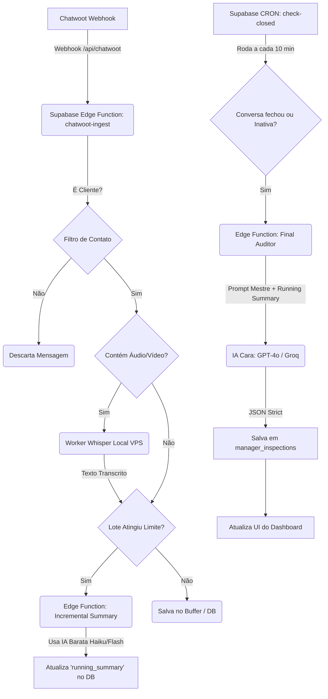

# Design: Auditoria Autônoma de Gerentes (gerentes-audit)

## Arquitetura Técnica
A arquitetura baseada em state-machine otimiza custos e garante que conversas muito longas não ultrapassem a janela de contexto ou aumentem os custos (Tokens).



## Contratos e Schemas

```sql
-- Schema sugerido para o novo App / Módulo:

CREATE TABLE manager_conversations_state (
    id UUID PRIMARY KEY DEFAULT uuid_generate_v4(),
    store_id TEXT NOT NULL,
    chatwoot_conversation_id TEXT UNIQUE NOT NULL,
    running_summary TEXT DEFAULT '',
    message_count INT DEFAULT 0,
    status TEXT DEFAULT 'open', -- 'open', 'closed'
    last_message_at TIMESTAMP WITH TIME ZONE DEFAULT NOW()
);

CREATE TABLE manager_inspections (
    id UUID PRIMARY KEY DEFAULT uuid_generate_v4(),
    store_id TEXT NOT NULL,
    manager_name TEXT,
    chatwoot_conversation_id TEXT NOT NULL,
    score INT,
    funnel_stage TEXT,
    audit_checklist JSONB,
    manager_failures TEXT,
    created_at TIMESTAMP WITH TIME ZONE DEFAULT NOW()
);
```

## Componentes / Lógica Core
- **`chatwoot-ingest` (Edge Function):** Recebe payloads pesados. Faz o **Filtro de Contato** verificando os `custom_attributes` do Lead no payload do Chatwoot (ex: se "Tipo" = "Fornecedor", dá Drop). Limpa metadados inúteis, armazenando apenas texto.
- **`audio-transcriber` (Python Worker - VPS):** Um script Python rodando em background na mesma VPS da API do Chatwoot. Usa o modelo Whisper (`openai-whisper`). Ele varre as mensagens do buffer que possuem anexo de áudio `.ogg`, transcreve localmente sem custo (CPU), atualiza a mensagem no banco com o texto e marca como 'transcrito'.
- **`incremental-summarizer` (Edge Function):** O coração da redução de custo. 
  - **Prompt da IA Barata:** "Você é um estenógrafo. Resuma as novas mensagens abaixo e adicione ao resumo existente. MANTENHA CITAÇÕES DIRETAS SE o cliente reclamar de preço, ou se o gerente fizer perguntas investigativas ou dar preços. Ignore conversas fiadas."
- **`final-auditor` (Edge Function):** Roda o Super-Prompt (O Cérebro Inquisidor) original, recebendo o `running_summary` ao invés das centenas de mensagens brutas.

## Cenários de Verificação (SCAN → INFER → VERIFY → FIX)
- Cenário 1: Conversa curta (menos de 5 mensagens).
  - -> Não aciona o resumidor incremental. Quando fecha, vai direto pro Auditor Final com as 5 mensagens brutas.
- Cenário 2: Conversa de 3 dias, 150 mensagens.
  - -> Resumidor atua a cada 20 mensagens (ou fim do dia). Quando fecha, o Auditor Final recebe 1 texto estruturado de 800 palavras com as anotações pontuais da negociação + as últimas 10 mensagens em natura para sentir o fechamento.
